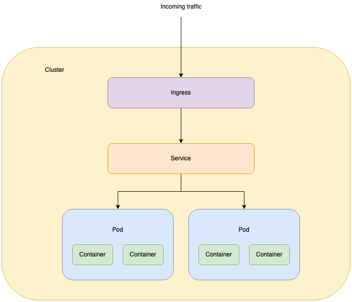

# Chapter 1: Core concepts

This is a very high-level description of the most important concepts of Kubernetes.

- A **cluster** is the runtime environment of an entire Kubernetes installation.
- A cluster can be spread across one or more physical **nodes**.
- Inside the cluster, we will deploy our application code in the form of **pods**. Each pod has a well-defined purpose and should be fairly stand-alone. The contents of a pod are always executed on the same physical node and in the same namespace.
- Each pod consists of one or more (usually Docker) **containers**. Each pod should either just include a single container, or a set of containers that are so tightly coupled that they are all needed in order to work together.
- A **service** is a grouping of a set of pods. The purpose of a service is to provide an abstraction that is used in order to expose access to the pods in the service. The reason is that individual pods can be spawned or killed at any moment, so it would not be a good solution to let every client keep track of the IP addresses of the currently available pods. Instead we let the service abstraction layer take care of that.

This diagram outlines the difference between most of these core components:

Continue to [**chapter 2**](./tutorial/cluster.md) in order to set up your first Kubernetes cluster!
